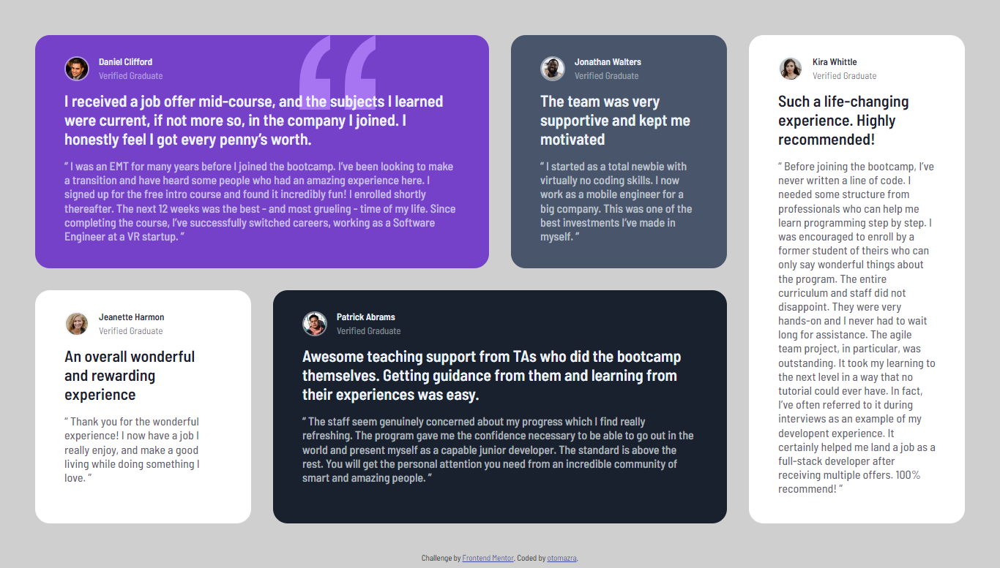
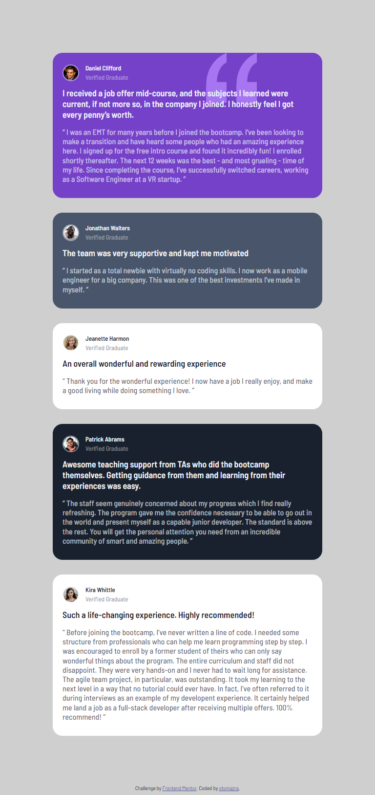
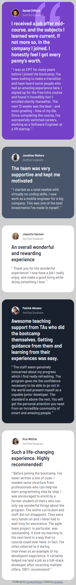

# Frontend Mentor - Testimonials grid section solution

This is a solution to the [Testimonials grid section challenge on Frontend Mentor](https://www.frontendmentor.io/challenges/testimonials-grid-section-Nnw6J7Un7). Frontend Mentor challenges help you improve your coding skills by building realistic projects. 

## Table of contents

- [Overview](#overview)
  - [The challenge](#the-challenge)
  - [Screenshot](#screenshot)
  - [Links](#links)
- [My process](#my-process)
  - [Built with](#built-with)
  - [What I learned](#what-i-learned)
  - [Continued development](#continued-development)
- [Author](#author)
  
## Overview

### The challenge

Users should be able to:

- View the optimal layout for the site depending on their device's screen size

### Screenshot

### Links

- Solution URL: [Add solution URL here](https://github.com/otomazra/Testimonials-grid-section)
- Live Site URL: [Add live site URL here](https://otomazra.github.io/Testimonials-grid-section/)

## My process

### Built with

- Semantic HTML5 markup
- CSS custom properties
- Flexbox
- CSS Grid

### What I learned

In this challenge I gained a meaningful experience in working on CSS Grid. All this time I worked with Flexbox and found it very useful. CSS Grid is an important addition to my front end skills. I will definitely start using it on my projects from now on.

### Continued development

I still feel lack of front-end confidence. Even though I have done multiple types of pages. Maybe I am too much of a perfectionist. I think I need to work on javascript programming and do other projects and challenges which include front-end design as well as programming. So I will keep training my front-end layout and programming skills together.

## Author

- Website - [Otar Mazrashvili](https://github.com/otomazra)
- Frontend Mentor - [@otomazra](https://www.frontendmentor.io/profile/otomazra)
- 

